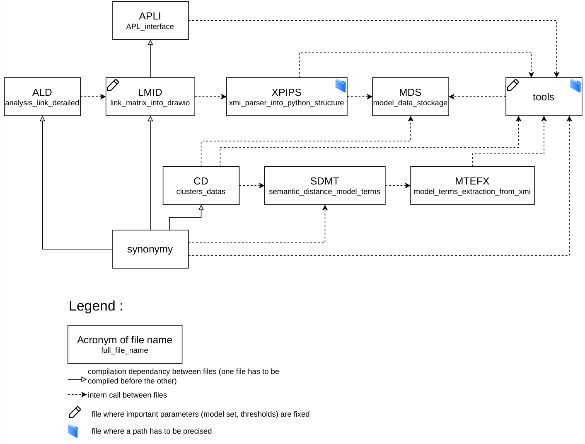

# Semantic-and-structural-comparison-for-Serious-Game-Models
A code to produce a consensus representation of several serious game models converted into UML.

## Before running the code

The software was developed using spyder and anaconda. The python libraries used are :
- nltk.corpus
- bs4
- numpy
- pandas
- sklearn.metrics
- scipy.cluster.hierarchy
- scipy.spatial.distance
- matplotlib.pyplot

You will also need to download the following github repositories :
- [https://github.com/kuro337/vembed](https://github.com/kuro337/vembed),
- [Drawio app](https://github.com/jgraph/drawio-desktop/releases/tag/v31.3.1).

Once you have all the libraries/apps to run the code, you will have to process 3 more steps:
1. Generate at least one XMI file describing a UML class diagram you want to compare (see **reference.xmi**), or download the XMI files associated with the project at [https://recherche.data.gouv.fr](https://recherche.data.gouv.fr),
2. Delete all after the 17th line of the **model_data_stockage** file,
3. Write the path of the project repository on **xmi_parser_into_python_structure** and **tools** files, and the path of the xmi repository on **tools**.

## To use the software

The calculation and synthetisation of metrics are done in 3 steps :
1. Running **synonymy** to extract the terms from xmi files and hierarchically cluster these terms. This take arround 30 minutes with a computer scientist PC (Intel Core Ultra 7 155H (16 Cœurs HT, 2.5-4.8 GHz Turbo, 24Mo cache)). The produced results will be written in **model_data_stockage** file, in python. This file also generate an image of a graph 
2. Running **link_matrix_into_drawio** to generate drawio files (*malp{id}_links{threshold}_cluster{threshold}*) and CSV files (*nb_models{id}*, *direction{id}*, *type{id}* and *nb_associations{id}*) representing tables used to generate the drawio files.
3. (Not required) Running **APL_interface** to avoid navigating in the produced files manually. N.B. To access all the functionalities of the interface, you will have to modify the thresholds specified in **link_matrix_into_drawio** (l. 558 and 568) and to specify a partial xmi file set in **tools** (l. 16 or 17) before re-do all the running process several times.

The **cluster_data** and **analysis_link_detailed** files are useful to produce more data about the clustering and the consensus representation. The data produced by **cluster_data** is stored in several files automatically generated by the algorithm, while the one of **analysis_link_detailed** is just printed on the terminal.

The dependancy of files is described bellow :

### Generated files and naming conventions

The generated files are organized into several repository, using specific terminologies :
- The graphs generated by **synonymy** are located on the root of the project. The corresponding files are named "nb_clusters_fonction_seuil{identifier}.png". The calculation of the identifier is detailed below.
- *StructuralComparison/Results/* contains the tables and the drawio of consensus representations, produced by **link_matrix_into_drawio**. The tables representing the direction, type, total number and representativity accross models of links between two clusters are respectively named "direction", "type", "nb_associations" and "nb_models". An identifier is also added to the file name (cf below). The drawio files are named "malp{identifier}_links{link_threshold}_clusters{cluster_threshold}", with the thresholds corresponding to the minimal number of model which have to present a term of the cluster/a link between to cluster to consider the cluster/link in the representation.
- *StructuralComparison/Results/Clusters_information* contains the results of **cluster_data**. Two kinds of file are generated by this source code : "clusters{identifier}.csv" gives the repartition of the terms accross clusters (1 column = 1 cluster), "clusters_by_models{identifier}" gives the number of terms per cluster (in column) and per model (in line).

The identifiers used in the file naming are generated automatically by the code, mapping each model (described in XMI) with a power of 2. When results are generated about the consensus representation, the identifiers of the models considered for the representation are added together, constituating a unique identifier for the set. For the total set, the file identifier is therefore $2^n-1$ (with n the total model number), the highest identifier generated.

## Links

The method implemented by the software has been published in the proceedings of GALA 2026. The full data associated to this article are available at [https://recherche.data.gouv.fr](???)

This work was funded by the ANR project TALE4GDA (ANR-23-CE38-0001) : [https://tale4gda.wp.imt.fr/](https://tale4gda.wp.imt.fr/).
